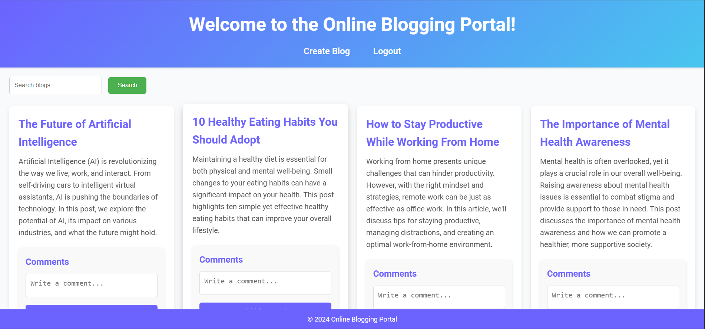
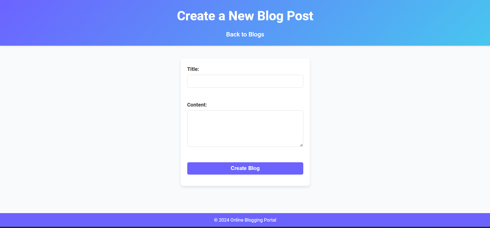
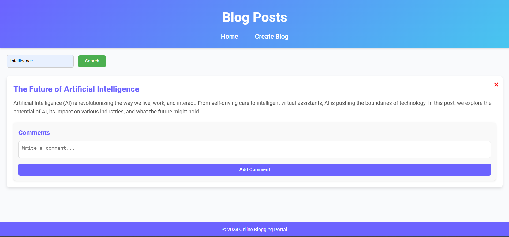

# Online Blogging System

An interactive blogging platform that allows users to create and manage blog posts. This project is divided into two components: a Spring Boot backend and a frontend using HTML, CSS, and JavaScript.

---

## 📖 Features
- User authentication (Login/Signup)
- Blog creation and management
- Blog search functionality
- Commenting system
- Responsive and visually appealing design

---

## 🛠️ Technologies Used

### Backend
- **Spring Boot**
- **MySQL**
- **JWT Authentication**

### Frontend
- **HTML, CSS, JavaScript**
- **Animate.css**

---

## 🚀 How to Set Up

### Prerequisites
- Java 17 or higher
- MySQL database
- Any modern web browser

### Steps to Run

#### Backend
1. Navigate to the `backend` folder:
   ```bash
   cd bloggingbackend
   ```

2. Configure the database:
   Open the `application.properties` file located in the `src/main/resources` folder of the `backend` project.

   Update the file with your MySQL database details:
   ```properties
   spring.datasource.url=jdbc:mysql://localhost:3306/<your_database_name>
   spring.datasource.username=<your_username>
   spring.datasource.password=<your_password>
   ```

   - **`<your_database_name>`**: Replace with the name of your database.
   - **`<your_username>`**: Replace with your MySQL username.
   - **`<your_password>`**: Replace with your MySQL password.

3. Create the database if it doesn't exist:
   ```sql
   CREATE DATABASE <your_database_name>;
   ```

4. Run the backend application using your IDE or Maven:
   ```bash
   mvn spring-boot:run
   ```

#### Frontend

1. Navigate to the `frontend` folder:
   ```bash
   cd online-blogging-frontend
   ```

2. Open the `index.html` file in any modern web browser to start the frontend application.

3. To test the functionality:
   - Use the search bar to look for blog posts.
   - Create a new blog by navigating to the **Create Blog** page.

---

## 📸 Screenshots

Place screenshots of your project in a `screenshots` folder within the `online-blogging-system` directory. Reference these screenshots in the README like this:

- **Homepage:**
  

- **Create Blog Page:**
  

- **Search Blog:**
  

---

## 📚 Additional Information

Feel free to improve or expand this project. If you encounter any issues, don't hesitate to reach out or create an issue in this repository.
